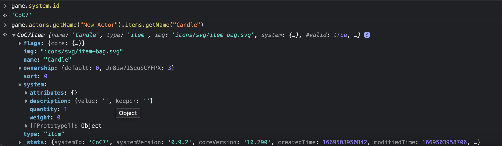

# Torch module for Foundry VTT

This module provides a HUD toggle button for turning on and off a configurable radius of bright and dim light around you. This default source ("Self") is provided for any system for which we don't supply more specialized capabilities. 

However, we now have a variety of core light sources configured for D&D 5th Ed, Savage Worlds, Pathfinder 1st and 2nd editions, GURPS, and Earthdawn. You can select which light source the button will manipulate by right-clicking and clicking the desired source from the menu of buttons that appear for light sources in the actor's inventory or spell list. 

Despite all that we have added, this module continues to follow the philosophy of being controllable in play from a single toggle button on the token HUD, and quickly configurable from there.

Out of the box, the following are available:

| System | Sources |
|--------|---------|
| dnd5e | Candle, Torch, Lamp, Bullseye Lantern, Hooded Lantern, Light, Dancing Lights
| swade | Candle, Flashlight, Lantern, Torch
| pf1 | Candle, Lamp, Lantern, Bullseye Lantern, Hooded Lantern, Miner's Lantern, Torch
| pf2e | Candle, Lantern (Hooded), Lantern (Bull's Eye), Torch. Everburning Torch
| sfrpg | "Comm Unit, Personal", "Portable Light, Beacon", "Portable Light, Flashlight", "Portable Light, Lantern", "Portable Light, Spotlight", 
| earthdawn4e | Candle, Lantern (Hooded), Lantern (Bullseye), Torch
| gurps | "Candle, Tallow", "Flashlight, Heavy", Mini Flashlight, Micro Flashlight, Survival Flashlight, Lantern, Torch, Bull's-Eye Lantern, "Electric Lantern, Small", "Electric Lantern, Large", Small Tactical Light, Large Tactical Light, Floodlight
| dcc | Lantern, "Torch, each"
| ose | Torches, Lantern
| reclaim-the-wild | Candle, Firewood, Lantern (1h, R0), Lantern (1h, R1),Lantern (1h, R2),Lantern (1h, R3), Lantern (1h, R4), Lantern (1h, R5), Torch (1h, R0), Torch (1h, R1), Torch (1h, R2), Torch (1h, R3), Torch (1h, R4), Torch (1h, R5)
| dragonbane | Lantern, Oil Lamp, Torch, Tallow Candle
| demonlord  | Candle, Lantern, Spotlight Lantern, Torch 

This module just sheds light from the location of a player token upon demand based upon equipment inventory. It is recommended *not* to use this module for spells or equipment that have other capabilities you intend to use, like performing damage or setting down the equipment, but to rely upon other common approaches, like active effects or item piles, for those.

Because the light source to use is now user-configurable, we no longer select a light source for you based on fallbacks. As it stands, if you do not explicitly select your light source, it will pick any among the light sources you have equipped, in no particular order. 
## Customizing light sources

You can supersede these settings or supply settings for your own light sources for any system with a JSON file, which you can deliver through the "Additional Light Sources" setting. We support JSON5 syntax, which is tolerant of trailing commas and comments. The following shows a fully specified light source and a couple of aliases:
```json
{
  "dnd5e": {
    "system": "dnd5e", // Optional but, if supplied, must match the key above
    "topology": "standard", // Optional - nearly all systems use standard topology
    "quantity" : "quantity", // Optional - "quantity" is the default - see notes below
    "aliases": {
      "Lantern (Bullseye)": "Bullseye Lantern",
      "Lantern (Hooded)": "Hooded Lantern"
    },
    "sources": {
      "Candle": {
        "name": "Candle",
        "type": "equipment",
        "consumable": true,
        "states": 2,
        "light": [ // If you have only 2 states, you can supply a single set of light stats rather than an array
          { 
            "bright": 10, "dim": 15, "angle": 360, "color": "#ff9329", "alpha": 0.5,
            "animation": { "type": "torch", "speed": 5, "intensity": 5, "reverse": false } 
          }
        ]
      },
      // Add additional sources for your system here
    }
  },
  // Add additional systems here
}
```
The JSON has one top-level property per system, keyed by the Foundry id of the system. For each system:
* The `system` value, if specified, should always be identical to the key. It can (and probably should) be omitted.
* The `topology` value has two possible values, defaulting to `standard` if omitted. 
  * `standard` topology: equipment are `Item` objects. Almost all systems are `standard`.
  * `gurps` topology: light sources are collected under a property of the actor and require GURPS-specific functions to find it, manipulate how many you've got, etc.
  * If you drag items to your character to "gear up", your system is almost certainly `standard`, so omit the setting.
* The `quantity` value tells the topology which property determines how many you have. It is a path to the quantity property within the "system" subtree of the object representing the light source. It defaults to `quantity`. 
  * For `standard`, it is the path to the field under item.system that contains the quantity. For nearly all systems, this is `quantity`. (For Earthdawn, however, it is `amount`.)
  * For `gurps`, it is the path to the field in a nested structure under the actor. It should be set to `amount`.
  * Some systems may not count inventory. For these, omit it, and use the default.

* The `sources` property has a sub-property for each light source you are creating or superseding. For each source:
  * The key is the name of the light source.
  * The `name` value, if specified, should always be identical to the key. It can (and probably should) be omitted.
  * The `type` value may be `equipment` or `spell`. If omitted, it defaults to `equipment`. 
  * The `consumable` value should be `true` or `false`. 
    * If `true`, when you use the light source, the inventory count goes down. The light source becomes unavailable when the quantity drops to zero. 
    * If `false`, the quantity in the inventory is ignored, but you still need the light source in your inventory to use it.
    * If not specified, it defaults to `false`. 
    * If your system doesn't count inventory, make sure all of your light sources either don't specify this field or set it to `false`.
    * If you find "counting your candles" a complete distraction from your game, you can turn this feature off using the "GM Uses Inventory" and "Player Uses Inventory" settings.
  * The `states` specifies how many states the light source toggles through. This allows for sources like hooded lanterns to toggle "high - low - off" if desired. It can be omitted and the number of states will be one more than the number of objects you supply to the `light` array. 
  * The `light` value is an array of objects that specify the light properties for each "on" light state. It has no default.
    * Values for the "off" state are taken from the settings for the actor's prototype token.
    * If you supply a single object rather than an array of objects, the module will treat it as an array of one item,  (a light source with a single "on" state, the most common condition), and `states` will default to 2.
  * In `animation`, the `type` field can currently take one of the following values. Aside from the first two, they match the list in the GUI in pretty obvious ways.
    * `flame` (for `Torch` animation)
    * `torch` (for `Flickering Light` animation)
    * `revolving`, `siren`, `pulse`, `chroma`, `wave`, `fog`, `sunburst`,`dome`, `emanation`,`hexa`, `ghost`, `energy`
    * `roiling`, `hole`, `vortex`, `witchwave`, `rainbowswirl`, `radialrainbow`, `fairy`, `grid`, `starlight`, `smokepatch` 

* The `aliases` property lets you specify alternate names for existing sources. Each entry has a key and a value:
  * The key is the new name of the source .
  * The value is the name (as a string) of the existing source being duplicated.
  * The source you duplicate with a new name can either be one of the predefined sources or one of the sources from the same user settings.

We now also support YAML, which some will find a lot easier to hand author. (Be sure to use the 'yaml' or 'yml' extension on your file.) The following is the equivalent YAML to the above JSON:
```yaml
---
dnd5e:
  system: dnd5e
  topology: standard
  quantity: quantity
  aliases:
    Lantern (Bullseye): Bullseye Lantern
    Lantern (Hooded): Hooded Lantern
  sources:
    Candle:
      name: Candle
      type: equipment
      consumable: true
      states: 2
      light:
      - bright: 10
        dim: 15
        angle: 360
        color: "#ff9329"
        alpha: 0.5
        animation:
          type: torch
          speed: 5
          intensity: 5
          reverse: false

```
### Determining your system's id, topology, and quantity

There are a few simple checks that can be done in a system to determine what to use for its id, topology and quantity values.

First, create an actor and give it the light source in question, either by creating one fresh or grabbing it from a compendium. Verify that the character sheet shows that the actor owns the gear. Adjust the quantity to some easily recognizable number, like 3, 5, 7, 13, something obvious. 

Suppose we create an actor named "Ebenezer" and give him a "Candle". Heck, we'll give him 16 of them.

Then, go into the browser console and type the following commands, adjusted for what you called your actor and light source:
```
game.system.id
game.actors.getName("Ebenezer").items.getName("Candle")
```
The system ID shown is the key name you should use for your system. The second value either gives you an object you can examine for the item or it gives you an error. If this returns a value, your topology is almost certainly standard.



In the item, expand the "system" property, and look for a sub-property whose name has something to do with quantity. If it has the same value you supplied, that clinches it. That's your quantity field. This is usually a simple property name like "quantity", "count", or "amount", but it may be nested in a structure, like Star Wars FFG's "quantity.value". That's the value to use for your system's "quantity" property in the JSON.

### Defining new topologies - something you almost never need to do

If you can't find your light sources among the actor's items, you may have stumbled across a system that will need its own topology defined, much as I discovered with GURPS. This requires a little code, but only a very little code. Define the new topology in topology.js. Supply an additional Topology class with implementations for the exported methods `actorHasLightSource`, `getImage`, `getInventory`, `setInventory`, and `decrementInventory`. PRs are gratefully accepted. :)

For example, the "Star Wars FFG" system embeds the quantity in the name of the item, so the item name goes from "Torches (3)" to "Torches (2)" as you consume them. Aside from this naming quirk, it is completely standard. A copy/paste of the standard topology that replaced its internal `_findMatchingItem` method with a function, perhaps regular-expression-based, that weeded out the stuff in the parentheses would do the trick.

Even without adding a topology, you can still use Torch with any new system - by doing nothing! If you don't define any JSON for the system, each user will get a single "self" light they can toggle, with dim/bright values the GM sets up in the game configuration. All of its other properties will come from the actor's prototype token. The downside of this is that the bright/dim game settings will apply identically to all players, regardless of what they're packing.

### Determining the real names of animation and coloration types

The easiest way I've found to do this is to set an actor's prototype token to use the types you're interested in and then export the actor from the sidebar. When you examine the file it creates, you should be able to see what it called that property on the prototype token's "light" value. That will tell you what string to use for its value in the Torch user settings to get the desired effect.

## API for macro authors

As of 2.8, macro authors can access the following functions of the module through `game.Torch`. All functions are async.

### `game.Torch.toggle(sceneId, tokenId)`
Walks the current light source of the specified token to its next state, returning the name of the state (typically 'on' or 'off' for simple two-state sources).

### `game.Torch.extinguish(sceneId, tokenId)`
Advances the current light source of the specified token to its 'off' state.

### `game.Torch.currentSource(sceneId, tokenId)`
Returns the name of the current light source for the specified token, if any.

### `game.Torch.currentState(sceneId, tokenId)`
Returns the current state of the current light source for the specified token.

### `game.Torch.equippedSources(sceneId, tokenId)`
Returns an array of the names of the light sources equipped by the specified token.

### `game.Torch.selectSource(sceneId, tokenId, source)`
Selects an equipped light source to be the current light source of the token.

### `game.Torch.inventory(sceneId, tokenId, source)`
Returns the remaining quantity of the specified light source for the specified token.

### `game.Torch.sourceExhausted(sceneId, tokenId, source)`
Returns true if the specified light source is consumable, and the instance held by the specified token has no more inventory.

## Changelog - now in [separate file](./CHANGELOG.md)

## Translation Status

The following is the current status of translation. Some features have arrived, introducing new strings, since translations were last done.

| Language | Completion | Contributors |
| -------- | ---------- | ------------ |
| de    | `[######################]` 22/22 (100%) | ToGreedy, Beff42 |
| en    | `[######################]` 22/22 (100%) | deuce, lupestro |
| es    | `[######################]` 12/22 (100%) | lozanoje, WallaceMcGregor |
| fr    | `[##################----]` 18/22 (82%) | Aymeeric |
| ja    | `[######################]` 22/22 (100%) | doumoku |
| pt-br | `[######################]` 22/22 (100%) | Innocenti, Andersants |
| zh-cn | `[##########------------]` 10/22 (56%) | xticime |
| zh-tw | `[############----------]` 12/22 (45%) | zeteticl |

PRs for further translations will be dealt with promptly. While Korean is most especially desired (thank you, doumoku for Japanese, also on the short list) - all others are welcome. 

Even now, it's only 22 strings, a satisfying afternoon, even for someone who's never committed to an open source project before, and your name will go into the readme right here next to the language. Fork, clone, update, _test locally_, commit, and then submit a PR. Holler for `@lupestro` on Discord if you need help getting started.

## History

This module was originally written by @Deuce. After it sustained several months of inactivity in 2021, @lupestro submitted a PR to get its features working reliably in FoundryVTT 0.8. Deuce agreed to transfer control to the League with @lupestro as maintainer, the changes were committed and a release was made from the League fork. 

All the PRs that were open at the time of the transfer are now committed and attention has turned to fulfilling some of the feature requests in a maintainable way while retaining the "one-button" character of the original module.

With Foundry VTT V10, the module code was rewritten, broken into several JS files to prepare for implementation of the most asked for features, still behind the single button, supported by a couple of new settings. This mechanism is now complete, pending possible requests for additional equipment topologies.

## License

 "THE BEER-WARE LICENSE" (Revision 42): (From torch.js in this module)
 
 <shurd@FreeBSD.ORG> wrote this file.  As long as you retain this notice you can do whatever you want with this stuff. If we meet some day, and you think this stuff is worth it, you can buy me a beer in return.        Stephen Hurd

(So I think we all owe Stephen a beer for making this thing.)